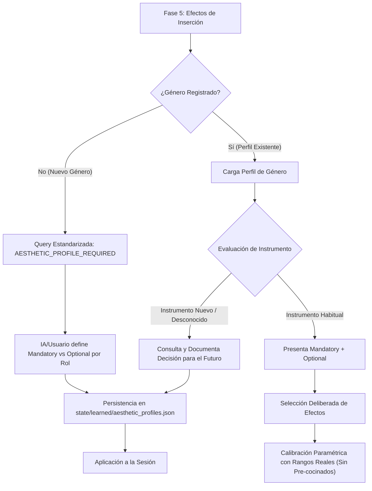

# Aesthetic Profile Engine (`AestheticProfileEngine`)

El motor de perfiles estéticos (**Aesthetic Profile Engine**) gobierna la selección, estructuración, recomendación y persistencia de cadenas de efectos de inserción en Ableton Live 12 a través del Copilot de producción (`guided_session`).

---

## 1. Principio Fundamental: Cero Cadenas por Defecto

> [!IMPORTANT]
> **Política Estricta de No Suposición:**
> El motor **NUNCA** selecciona cadenas por defecto ni asume procesadores innecesarios a espaldas del productor.
> Para cada pista en la **Fase 5 (Efectos de Inserción)**, el motor formula una consulta deliberada e interactiva con los rangos acústicos reales, requiriendo que la IA o el usuario decidan conscientemente qué procesadores insertar y cómo calibrar sus parámetros.

---

## 2. Arquitectura de Perfil Estético



---

## 3. Esquema Estructurado para Nuevos Géneros

Cuando se detecta un género sin perfil registrado en el catálogo maestro, el motor detiene la ejecución automática y emite un requerimiento estandarizado (`AESTHETIC_PROFILE_REQUIRED`):

```json
{
  "status": "AESTHETIC_PROFILE_REQUIRED",
  "phase": "PHASE_5_INSERT_EFFECTS",
  "genre": "hyperpop",
  "current_step": "PASO 5: PERFIL ESTÉTICO REQUERIDO (GÉNERO 'HYPERPOP')",
  "schema_expected": {
    "DRUMS": {
      "mandatory": ["EQ Eight", "Glue Compressor"],
      "optional": ["Saturator", "Redux"]
    },
    "BASS": {
      "mandatory": ["EQ Eight", "Utility"],
      "optional": ["Saturator", "Compressor"]
    },
    "LEAD": {
      "mandatory": ["EQ Eight", "Compressor"],
      "optional": ["Delay", "ValhallaVintageVerb"]
    },
    "KEYS": {
      "mandatory": ["EQ Eight"],
      "optional": ["Chorus-Ensemble", "ValhallaVintageVerb"]
    },
    "PAD": {
      "mandatory": ["EQ Eight"],
      "optional": ["ValhallaSupermassive", "Auto Pan"]
    },
    "VOCALS": {
      "mandatory": ["EQ Eight", "Auto-Tune Artist", "Compressor"],
      "optional": ["ValhallaVintageVerb", "MicroShift"]
    },
    "FX": {
      "mandatory": ["EQ Eight"],
      "optional": ["ValhallaSupermassive", "Delay"]
    }
  }
}
```

La IA o el usuario pueden responder en JSON o en texto estructurado ordenado:
```text
DRUMS: obligatorio: EQ Eight, Glue Compressor; opcional: Saturator, Redux
BASS: obligatorio: EQ Eight, Utility; opcional: Saturator, Overdrive
```

El motor parsea automáticamente la respuesta, garantiza la compuerta de seguridad espectral (`EQ Eight` siempre obligatorio para evitar solapamientos y desbordes subgraves) y almacena el perfil en `state/learned/aesthetic_profiles.json`.

---

## 4. Clasificación de Efectos: Obligatorios vs Opcionales

| Categoría | Característica | Justificación Acústica | Ejemplos Típicos |
|---|---|---|---|
| **Obligatorios (`mandatory`)** | Procesadores esenciales para la integridad física del audio y la convivencia espectral en la mezcla. | Eliminación de subgraves inaudibles (<25 Hz), anclaje monofónico en graves (<120 Hz) y control de picos transitorios. | `EQ Eight`, `Utility` (en bajos), `Compressor` / `Glue Compressor`. |
| **Opcionales (`optional`)** | Procesadores de carácter tímbrico, color armónico y espacialización. | Dependen de la densidad del arreglo, tempo y gusto estético. Se consultan deliberadamente por canal. | `Saturator`, `Redux`, `ValhallaVintageVerb`, `ValhallaSupermassive`, `Surge XT Effects`, `Chorus-Ensemble`, `Delay`. |

---

## 5. Libro Mayor de Decisiones de Instrumento (*Instrument Decision Ledger*)

Cuando un canal cuenta con un generador nuevo o atípico (ej. `Moog Sub 37 Lead Pluck`, `Microfreak Arp`, sintetizadores modulares):

1. El motor consulta específicamente los efectos y configuraciones deseados para ese instrumento.
2. Tras la selección, ejecuta `document_instrument_decision(...)`:
   ```python
   engine.document_instrument_decision(
       genre="trap",
       instrument_name="Moog Sub 37 Lead Pluck",
       role="LEAD",
       effects_added=["EQ Eight", "Saturator", "ValhallaVintageVerb"],
       configurations={"Drive": 0.45, "Decay": 1.2},
       reason="Warm analog bite with subtle room diffusion."
   )
   ```
3. La decisión queda registrada de forma persistente.
4. En sesiones futuras que utilicen ese mismo instrumento dentro del género, el motor sugiere proactivamente la cadena probada con su justificación histórica.

---

## 6. Persistencia y Almacenamiento

- **Ubicación:** `state/learned/aesthetic_profiles.json`
- **Semillas Iniciales Incluidas:**
  - `trap`: Enfoque en pegada transitoria de caja/snare, 808 mono centrado y espacio aéreo en platillos.
  - `edm`: Compresión multibanda, sidechain marcado a bombo y reverberaciones épicas tipo Bright Hall.
  - `techno`: Saturación agresiva en bombo (rumble sub-reverb), delay hipnótico en leads y texturas oscuras.
- **Ciclo de Guardado:** Atómico con codificación UTF-8 e indentación de 2 espacios.

---

## 7. Integración en `Phase5InsertEffectsHandler`

1. **Detección Previa:** Al entrar a la Fase 5, valida si `session.data["genre"]` está registrado en `AestheticProfileEngine`. Si no lo está, pausa e invoca `build_standardized_genre_query`.
2. **Consulta Pista por Pista:** Muestra el desglose de obligatorios y opcionales, decisiones históricas de instrumentos y solicita confirmación o personalización de la cadena.
3. **Esculpido Paramétrico:** Itera sobre los efectos seleccionados presentando rangos acústicos reales (dB, Hz, ms, normalizados) sin valores pre-fabricados que impidan el razonamiento analítico de la IA.
