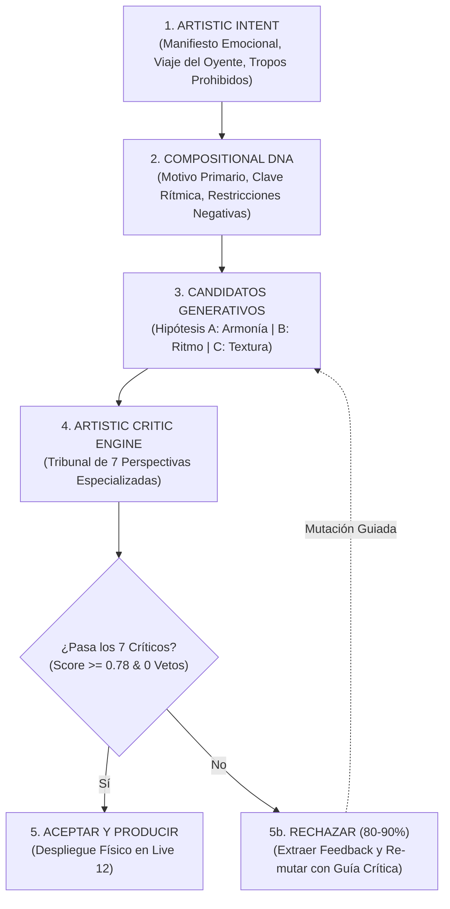

# Sistema de Dirección Artística Generativa: Artistic Intent, Artistic Critic Engine & Selection Loop

> **Documento Arquitectónico y Manual Operativo**  
> **Estado:** Implementado y Verificado (100% verde)  
> **Paquetes:** `engine/creative/` (`artistic_intent.py`, `artistic_critic/`, `selection_loop.py`, `identity_stress_test.py`)

---

## 1. Fundamento Filosófico: El Salto Vertical

El avance en producción musical asistida por IA suele cometer el error de crecer **horizontalmente**:
$$\text{Más técnicas} + \text{Más presets} + \text{Más analizadores} = \text{Canciones sofisticadas sin alma}$$

Un generador mediocre produce muchas ideas técnicamente correctas. Un **Director Artístico Generativo** sabe decir:
> *"Esto funciona técnicamente, pero no pertenece a esta obra. Destrúyelo."*

El crecimiento **vertical** implementado en esta arquitectura invierte el flujo de trabajo:



---

## 2. Manifiesto de Intención Artística (`ArtisticIntent`)

Antes de emitir una sola nota o elegir un instrumento, el sistema responde: **¿Qué quiere hacer y decir esta canción?**

### Estructura del Manifiesto:
* **`emotional_core`:** Lista de emociones cardinales (ej. `["nostalgia", "confidence", "restrained_aggression"]`).
* **`listener_experience` (`EmotionalJourney`):** Travesía perceptual en 4 actos:
  * `beginning`: ej. *"bare room, solo voice, dry acoustic noise"*.
  * `middle`: ej. *"hypnotic, escalating tension, focused groove"*.
  * `climax`: ej. *"overwhelming, cathartic dynamic bloom"*.
  * `ending`: ej. *"unresolved, lingering resonance, lone decay"*.
* **`identity_aesthetic`:** Tríada de estilo (`primary`, `secondary`, `signature: "beautiful imperfection"`).
* **`signature_sound_brief`:** Descripción del evento tímbrico exclusivo e irrepetible de la canción.
* **`forbidden_tropes`:** Lista negra explícita de clichés prohibidos para esta obra (ej. `["generic_trap_hats", "unextended_major_triads", "constant_maximal_density"]`).
* **`risk_tolerance`:** Tolerancia al riesgo ($0.0$ a $1.0$).
* **`deviation_budget`:** Presupuesto de desviación para permitir sorpresa sin caer en caos.

### Ley Inviolable (`serves_intent`):
Toda propuesta que contenga un tropo prohibido o viole el viaje emocional es **vetada y destruida de inmediato**.

---

## 3. El Tribunal de 7 Jueces (`ArtisticCriticEngine`)

El motor somete cada propuesta a 7 perspectivas independientes y especializadas:

| Juez Crítico | Pregunta Cardinal | Métricas y Detecciones | Condición de VETO |
|---|---|---|---|
| **1. Identity Critic** | *¿Podría intercambiarse por otra canción del catálogo sin que nadie lo note?* | Huellas dactilares (melódica, rítmica, armónica, tímbrica, espacial) y unicidad frente a `CatalogMemory`. | Unicidad $< 0.65$ o clon de receta idéntica existente. |
| **2. Memorability Critic** | *¿Qué queda en la cabeza tras terminar la canción?* | Conteo de eventos icónicos (gancho de motivo, vacío rítmico, chop vocal, textura firma). | **0 eventos** (plana/olvidable) o **$>4$ eventos** (saturación cognitiva). |
| **3. Predictability Critic** | *¿La sorpresa ocurre en el momento y proporción correctos?* | Balance entre patrón establecido y desviación frente a `deviation_budget`. | Desviación excesiva ($> \text{presupuesto} + 0.35$ $\to$ caos) o $0\%$ desviación en repeticiones. |
| **4. Emotional Critic** | *¿La emoción realmente cambia o solo cambian los parámetros?* | Distingue `parameter change` (densidad $0.4 \to 0.8$) de `perceived change` (tensión psicoacústica). | Gimnasia matemática vacía: parámetros oscilando con impacto percibido $< 0.15$. |
| **5. Human Plausibility Critic** | *¿Parece que alguien tomó decisiones o fue generada por una máquina?* | Caza de firmas mecánicas: std dev de velocities $< 5$, simetría artificial, fills en reloj. | Firma de máquina $\ge 0.70$. |
| **6. Sonic Signature Critic** | *¿Hay algún sonido que SOLAMENTE pertenezca a esta canción?* | Existencia de textura/gesto acústico exclusivo nacido de diseño sonoro intencional. | Ausencia total de firma o $100\%$ presets genéricos de fábrica. |
| **7. Genre Plausibility Critic** | *¿La mezcla de influencias es coherente o es un monstruo de Frankenstein?* | Vocabulario esperado del género vs presupuesto de desviación estilística. | Colisión incompatible de tropos o desviación $> \text{presupuesto} + 0.30$. |

---

## 4. Bucle de Selección y Rechazo Vertical (`TasteAndSelectionLoop`)

El bucle de selección materializa la tasa de rechazo artístico del **80%–90%**:

1. **Generación Concurrente:** Genera un grupo de 3 a 5 candidatos (armónico, rítmico, tímbrico, experimental).
2. **Juicio Concurrentemente:** Cada candidato es juzgado por los 7 críticos.
3. **Destrucción y Selección:**
   * Si un candidato recibe **un solo veto**, queda descalificado.
   * Si todos los candidatos son rechazados, el motor toma el mejor fallo, extrae el `feedback_for_mutation` de los jueces y ejecuta una **mutación correctiva guiada**.
   * Repite el ciclo (hasta 4 generaciones) hasta hallar un ganador con puntuación $\ge 0.78$ y cero vetos.

---

## 5. Identity Stress Test (10 Arquetipos Extremos)

Para validar que el motor no converge a clichés ni fórmulas homogéneas, se implementó la suite de prueba de estrés con **10 arquetipos deliberadamente opuestos**:

```text
1. Song 01 — Minimal / Intimate        (72 BPM, C minor, felt piano + tape warble)
2. Song 02 — Aggressive / Dense        (155 BPM, F# minor, industrial FM lead + 808 transient)
3. Song 03 — Psychedelic               (94 BPM, Ab minor, kalimba binaural + reverse shimmer)
4. Song 04 — Melancholic               (80 BPM, Bb minor, cello overtone scrape + freeze delay)
5. Song 05 — Futuristic                (168 BPM, D minor, formant comb vocal glissando + OTT)
6. Song 06 — Raw / Lo-Fi               (85 BPM, Eb minor, detuned Rhodes + SP-404 vinyl flutter)
7. Song 07 — Soulful                   (98 BPM, Db major, gospel hammond Leslie swell)
8. Song 08 — Rhythmically Strange      (133 BPM, G minor, 7/8 ringmod guitar clave)
9. Song 09 — Cinematic                 (64 BPM, F minor, French horn 10s convolution reverb)
10. Song 10 — Deliberately Sparse      (55 BPM, A minor, hydrophone water droplet resonance)
```

### Resultados de la Prueba de Estrés:
* **Total Canciones:** 10 / 10 Aprobadas por el jurado crítico.
* **Colisiones de Recetas entre Canciones:** $0$
* **Colisiones de Intervalos de Motivo:** $0$
* **Firmas Sonoras Únicas:** $10 / 10$ ($100\%$ no-intercambiables)
* **Índice de Diversidad de Catálogo (`CatalogDiversityIndex`):** $\mathbf{0.883} \ge 0.85$
