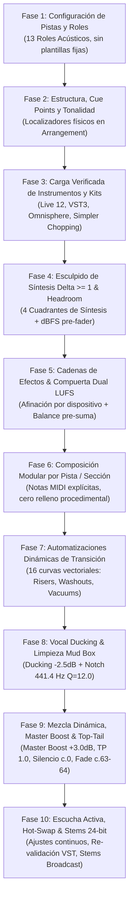
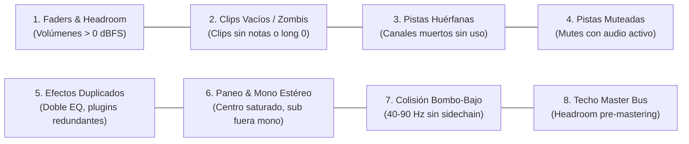

# Manual Maestro de `copilot_guided_session` & `copilot_session_doctor`
## Dirección Técnica Integral, Producción Conversacional de 10 Fases y Clínica de Sesión Acústica

---

## 1. Dos Pilares Maestros de Producción e Intervención

AbletonEngine estructura la asistencia musical avanzada sobre dos pilares independientes y complementarios:

```mermaid
flowchart TD
    subgraph PilarA["Pilar A: copilot_guided_session (Creación Integral)"]
        A1["Proyecto Nuevo / Blank Canvas"] --> A2["Pipeline Guiado de 10 Fases"]
        A2 --> A3["Composición, Arreglo y Esculpido Tímbrico"]
        A3 --> A4["Mastering DSP BS.1770-5 & Exportación 24-bit/44.1kHz"]
        A4 --> A5["Fase 10: Escucha Activa & Hot-Swap de Instrumentos"]
    end

    subgraph PilarB["Pilar B: copilot_session_doctor (Clínica y Reparación)"]
        B1["Proyecto Existente del Productor"] --> B2["Auditoría LOM y Acústica No Destructiva (8 Dimensiones)"]
        B2 --> B3["Cola Priorizada de Hallazgos (Crítico / Advertencia / Optimización)"]
        B3 --> B4["Prescripciones Quirúrgicas Paso a Paso con Snapshot"]
        B4 --> B5["Aprobación Interactiva (Sí / No / Valor / Rollback)"]
    end
```



1. **`copilot_guided_session` (Creación e Iteración)**: Diseñado para orquestar canciones completas desde cero o transformar arreglos existentes mediante una máquina de estados conversacional de **10 fases rigurosas**, garantizando calidad de audio comercial, verificación física en Live 12 y cumplimiento de normas internacionales de sonoridad (ITU-R BS.1770-5).
2. **`copilot_session_doctor` (Clínica de Estudio y Reparación Quirúrgica)**: Diseñado para auditar, diagnosticar y curar proyectos ya existentes del usuario sin borrar clips, sin reiniciar sesiones y sin imponer composiciones. Trabaja en aislamiento absoluto (`state/production/doctor_session.json`) con puntos de restauración de seguridad (*snapshots*) y reversión instantánea (*rollback*).

---

## 2. Código de Gobernanza Estricto (Reglas Inviolables)

Estas reglas erradican cualquier complacencia del motor y aseguran resultados profesionales y repetibles:

### 🚨 REGLA 1: CERO ESTIMACIONES SINTÉTICAS (Audio Real Físico Obligatorio)
- Queda terminantemente prohibido generar reportes de sonoridad utilizando fórmulas sintéticas o aproximaciones matemáticas.
- Las mediciones de LUFS Integrado, True Peak y rango dinámico (LRA) provienen **estrictamente de archivos WAV físicos renderizados** o del streaming PCM estéreo en vivo capturado por socket UDP (puerto 9878). Si no hay audio físico medible, el valor devuelto es `None` y la compuerta permanece cerrada.

### ⛔ REGLA 2: COMPUERTAS BLOQUEANTES INCONDICIONALES
- Ninguna sesión avanza a la siguiente fase cantando falsas victorias.
- Si una compuerta detecta desbalance (ej. canal vocal por debajo del target de ganancia o master fuera de tolerancia), la sesión se congela hasta que se aplique la calibración física correspondiente o el usuario autorice conscientemente una tolerancia flexible.

### 🛡️ REGLA 3: CERO SILENCIAMIENTO DE ERRORES (Zero Silent Swallow)
- Queda prohibido capturar excepciones de plugins o conexiones en bloques complacientes que fingen que el canal está listo.
- Si un VST3, archivo de preset `.adg`/`.adv` o Drum Rack no carga físicamente en la LOM de Live, la acción se bloquea inmediatamente arrojando `VERIFICATION_FAILED` y presentando opciones comprobadas del catálogo curado.

### 🥁 REGLA 4: AUDITORÍA DE DRUM RACKS Y PADS FÍSICOS
- En pistas de batería (`DRUMS`), el motor audita vía API (`get_drum_rack_pads` / `get_drum_pad_devices`) que los pads estándar de Live (Kick 36/C1, Rimshot 37/C#1, Snare 38/D1, Clap 39/D#1, Hats 42/F#1, Open Hat 46/A#1, Crash 49/C#2) contengan samples reales asignados.

### 🎛️ REGLA 5: ESCULPIDO OBLIGATORIO DE SÍNTESIS ($\Delta \ge 1$)
- Prohibido dejar sintetizadores o plugins en estado inicial de fábrica (*Init* o sierra cruda).
- Se audita que al menos un control interno de síntesis haya cambiado conscientemente respecto al estado base antes de componer clips o notas.

### 🔌 REGLA 6: AFINACIÓN EFECTO POR EFECTO, PARÁMETRO POR PARÁMETRO
- Los procesadores de inserción se recorren individualmente, esculpiendo sus parámetros analógicos y acústicos reales (Threshold, Attack, Release, Drive, Transients, Crunch, Mix, Feedback).

### 🎼 REGLA 7: COMPOSICIÓN MODULAR CON SILENCIOS ESTRUCTURALES
- Prohibido pegar bucles idénticos uniformes a lo largo de 64 compases.
- Cada sección del Arrangement (Intro, Verso, Drop, Puente, Clímax) posee un rol acústico definido: los instrumentos inactivos permanecen en estricto silencio para generar contraste dinámico real.

### 📈 REGLA 8: AUTOMATIZACIONES DINÁMICAS EN ARRANGEMENT
- Las transiciones se dibujan físicamente en los carriles de automatización de Live (curvas ascendentes de filtro, disoluciones espaciales con corte seco en el downbeat, vacíos de señal pre-drop y fades de salida).

### 🚫 REGLA 9: CERO PLANTILLAS ESTÁNDAR FIJAS (13 Roles Acústicos)
- El motor no utiliza plantillas fijas de canales. Ofrece un catálogo completo de **13 roles acústicos** (`DRUMS`, `KICK`, `BASS`, `KEYS`, `GUITAR`, `BRASS`, `CHOIR`, `STRINGS`, `PAD`, `LEAD`, `PERCUSSION`, `VOCALS`, `FX`) con cientos de instrumentos verificados (Live 12 Suite, Arturia Analog Lab V, Spectrasonics Omnisphere, Xfer Serum 2, Vital, Kontakt 8 y Simpler personal).

### 🛡️ REGLA 10: INMUTABILIDAD PRE-FLIGHT Y SEGURIDAD TRANSACCIONAL
- Al arrancar un nuevo track con `copilot_guided_session(reset=True)`, el pre-flight cleaner limpia transportes colgados, cue points viejos y clips residuales para iniciar desde una línea base idéntica y reproducible.

---

## 3. Pipeline de 10 Fases de `copilot_guided_session`



### Detalle de las 10 Fases:

1. **Fase 1 (`PHASE_1_TRACKS`): Scaffolding de Pistas y Asignación de Roles**
   - El productor/IA elige cualquier combinación libre entre los 13 roles acústicos.
   - Soporte nativo para pistas MIDI de síntesis, pistas de Audio (micrófono en vivo o tomas) y buses auxiliares FX con monitoreo en tiempo real (`In`).
2. **Fase 2 (`PHASE_2_SECTIONS`): Estructura Formal, Marcadores y Tonalidad**
   - Configura opciones canónicas de compases (Opción A: 96 compases, Opción B: 64 compases, Opción C: 128 compases, Opción D: 88 compases).
   - Genera localizadores físicos (*Cue Points*) en la línea de tiempo de Live y calibra la escala y afinación global del proyecto (`song.root_note`, `song.scale_name`).
3. **Fase 3 (`PHASE_3_INSTRUMENTS`): Carga Física Verificada de Instrumentos**
   - Presenta fuentes verificadas del catálogo curado con cero adivinanza de URIs.
   - Pistas vocales: Opción de grabación con micrófono en vivo (Live Tracking armado con monitorización Auto y cadena de captura), carga de archivo o rebanado en Simpler.
   - Pistas de batería: Verificación física de pads de Drum Rack a partir de C1 (36 a 51).
4. **Fase 4 (`PHASE_4_PARAM_SCULPTING`): Esculpido de Síntesis ($\Delta \ge 1$) y Calibración dBFS**
   - Esculpido de los 4 cuadrantes de síntesis (Osciladores, Filtros, Envolventes ADSR, Espacio/Modulación).
   - Calibración de headroom pre-fader inicial según categoría tímbrica (-12 a -18 dBFS).
5. **Fase 5 (`PHASE_5_INSERT_EFFECTS`): Procesadores de Inserción y Compuerta Dual LUFS**
   - Inserción y esculpido en serie: `EQ Eight`, `Glue Compressor`, `Drum Buss`, `Saturator`, `Chorus-Ensemble`, `ValhallaVintageVerb`, `Auto-Tune Artist`, `Pro-Q 4`, `Saturn 2`.
   - **Compuerta Dual LUFS**: Audita individualmente la pista vocal o solista contra su target pre-suma (-18.0 LUFS) y el Master Bus (-14.0 LUFS) antes de permitir avanzar a notas.
6. **Fase 6 (`PHASE_6_COMPOSITION`): Composición Modular de Notas por Pista**
   - Composición estricta: Se prohíbe el relleno procedimental genérico. Se inyectan notas MIDI explícitas (`pitch`, `start_time`, `duration`, `velocity`) por secciones.
   - Despliegue atómico en Session Slots y estampado en la línea temporal de Arrangement.
7. **Fase 7 (`PHASE_7_AUTOMATION`): Curvas de Automatización y Movimiento**
   - Inyección de 16 curvas vectoriales en Arrangement (`FILTER_SWEEP_UP`, `REVERB_WASHOUT`, `PRE_DROP_VACUUM`, `OUTRO_FADE`).
8. **Fase 8 (`PHASE_8_VOCAL_DUCKING`): Vocal Ducking y Limpieza Quirúrgica Mud Box**
   - Sidechain dinámico vocal sobre pistas armónicas (`Keys`, `Pad`) con -2.5 dB de atenuación transparente.
   - **Limpieza Automática de Resonancias Mud Box**: Filtro notch quirúrgico automático en **441.4 Hz** (-3.5 dB, factor ultra-estrecho $Q = 12.0$) aplicado sobre pistas armónicas y Master Bus EQ Eight Band 3 para limpiar la zona 200–500 Hz inmediatamente después de la voz.
9. **Fase 9 (`PHASE_9_MIX_MASTER`): Mezcla Dinámica, Master Boost y Guardia Top & Tail**
   - **Master Gain Boost**: Impulso de ganancia de entrada del Limitador nativo entre **+2.5 dB y +3.5 dB** (`gain_norm: 0.635`, param 1) con `True Peak Mode` forzado en **1.0** (param 7) para situar el True Peak entre -1.0 dBTP y -1.5 dBTP y el LUFS entre -13.5 y -14.0 LUFS.
   - **Top & Tail Acoustic Guard**:
     * *Compás 0 (0.0s):* Compuerta de silencio estricto ($< -70	ext{ dBFS}$) previa al primer acorde, suprimiendo ruidos residuales de plugins VST y soplos analógicos.
     * *Compás 63–64 (beats 252.0 a 256.0):* Desvanecimiento exponencial de reverberación a $-\infty	ext{ dB}$ para garantizar silencio digital absoluto al cruzar el compás 64.
   - **Certificación DSP ITU-R BS.1770-5 Real**: Medición obligatoria de archivo WAV o stream UDP.
10. **Fase 10 (`PHASE_10_COMPLETED`): Escucha Activa, Hot-Swap y Stems de Entrega Comercial**
    - **Navegación de Transporte**: `"Saltar al Intro"`, `"Ir al Verso"`, `"Saltar al Drop 1"`, `"Reproducir compás 32"`.
    - **Hot-Swap de Instrumentos con Re-validación Técnica (`"Cambiar instrumento"`)**: Permite sustituir cualquier instrumento de la sesión sin perder las notas del arreglo, guiando el ciclo completo de validación: Carga VST $	o$ Esculpido $\Delta \ge 1$ $	o$ EQ Eight Obligatorio $	o$ Preservación MIDI $	o$ Re-auditoría LUFS.
    - **Exportación Comercial de Stems 24-bit / 44.1 kHz (`"Exportar stems"`):** Genera el paquete oficial de 6 archivos Broadcast WAV en `exports/stems/`:
      * `00_MASTER.wav`
      * `01_DRUMS.wav`
      * `02_BASS.wav`
      * `03_KEYS_BRASS.wav`
      * `04_VOCALS.wav`
      * `05_FX.wav`
      * `stems_manifest.json` con auditoría de fase subgrave ($
ho \ge 0.35$) y verificación de margen dinámico.

---

## 4. `copilot_session_doctor` (El Doctor de Sesión — Manual Clínico Completo)

### Propósito y Filosofía No Destructiva
A diferencia de `guided_session` (que arranca desde una hoja en blanco y guía la creación musical), **`copilot_session_doctor`** actúa como un **médico especialista de cabecera para proyectos existentes de Ableton Live**:
- **Nunca borra tu sesión**: No ejecuta `preflight_clean_session`.
- **Nunca impone notas ni composiciones**: Respeta al 100% las melodías, armonías y ritmos creados por el productor.
- **Aislamiento Total**: Opera sobre su propio archivo de estado `state/production/doctor_session.json`.
- **Seguridad Garantizada con Snapshots y Rollback**: Antes de cualquier intervención, captura una instantánea inmutable de la sesión en Live. El usuario puede escribir `"Deshacer"` o `"Rollback"` en cualquier instante para revertir los cambios de inmediato.

### Las 8 Dimensiones Clínicas de la Auditoría



1. **Faders y Headroom de Pistas**:
   - Detecta canales operando por encima de 0.85 (0 dBFS nominal) que inducen saturación digital en los buses de mezcla.
   - Prescripción: Re-calibra a niveles seguros de gain staging (-14 a -12 dBFS).
2. **Clips Vacíos y Zombis**:
   - Localiza clips MIDI sin notas o clips de audio con longitud cero en las ranuras de Session y pistas de Arrangement que consumen procesamiento.
   - Prescripción: Limpieza quirúrgica de ranuras muertas.
3. **Pistas Huérfanas**:
   - Identifica canales sin clips, sin instrumentos, sin dispositivos y sin ruteos que congestionan la pantalla del DAW.
   - Prescripción: Opciones para eliminar o consolidar.
4. **Pistas Silenciadas con Contenido Crítico**:
   - Alerta si pistas que contienen material activo relevante quedaron accidentalmente en Mute.
   - Prescripción: Reactivación o confirmación consciente del productor.
5. **Efectos Duplicados y Apilamiento Redundante**:
   - Localiza procesadores repetidos consecutivamente en la misma pista (ej. doble `EQ Eight`, dos compresores con settings idénticos) que introducen desfases innecesarios.
   - Prescripción: Eliminación del procesador redundante.
6. **Paneo Espacial y Compatibilidad Mono**:
   - Alerta si 3 o más instrumentos armónicos están amontonados exactamente en el centro mono (`panning = 0.0`), o si subgraves (<120 Hz) están abiertos en estéreo provocando cancelaciones de fase al reproducir en mono o sistemas de club.
   - Prescripción: Distribución LCR musical y forzado mono subsónico mediante `Utility`.
7. **Colisión Psicoacústica Bombo vs Bajo (Low-End Clash)**:
   - Audita el rango 40–90 Hz entre la pista de bombo y bajo. Si no existe compresión sidechain configurada, alerta sobre enmascaramiento y pérdida de pegada.
   - Prescripción: Configuración inmediata de sidechain ducking de bombo a bajo.
8. **Techo y Headroom del Master Bus**:
   - Audita que la pista Master conserve al menos 6 dB de margen pre-mastering para evitar recortes inter-sample antes de entrar al limitador True Peak.

### Flujo Operativo del Doctor (Paso a Paso)

```python
# 1. Iniciar la clínica sobre el proyecto actual en Ableton Live:
copilot_session_doctor(user_input="", reset=True)

# 2. El Doctor realiza el escaneo multi-dimensional y entrega el informe priorizado:
#    🔴 Crítico: 2 hallazgos
#    🟡 Advertencia: 3 hallazgos
#    🔵 Optimización: 1 hallazgo
#    Y presenta de inmediato el DETALLE #1.

# 3. Interacción por hallazgo:
copilot_session_doctor(user_input="Sí")          # Aplica la prescripción quirúrgica recomendada
copilot_session_doctor(user_input="No")          # Omite el hallazgo y pasa al siguiente
copilot_session_doctor(user_input="-14 dBFS")    # Proporciona un valor personalizado
copilot_session_doctor(user_input="Deshacer")    # Revierte la última corrección con el snapshot de seguridad
```

---

## 5. Guía Rápida de Comandos en Fase 10 (Lenguaje Natural)

Una vez completada la producción o durante la clínica, el Copilot recibe instrucciones directas en la misma herramienta:

| Intención del Usuario | Comando de Ejemplo | Acción del Motor |
| :--- | :--- | :--- |
| **Navegación** | `"Saltar al Drop 1"` o `"Ir al compás 32"` | Ubica el cursor de transporte de Live en el locator y reproduce. |
| **Cambio de Timbres** | `"Cambiar instrumento"` | Inicia el flujo guiado de sustitución y re-validación técnica del canal. |
| **Ajuste de Mezcla** | `"Bájale 2.5 dB al bajo"` | Calibra faders en dBFS con auto gain staging. |
| **Control Espacial** | `"Abre los pads a la derecha"` | Modifica el panorama estéreo respetando el campo acústico. |
| **Master Gain Boost** | `"Impulsar ganancia del limitador"` | Ajusta Limiter Gain +3.0 dB con True Peak activado. |
| **Limpieza Mud Box** | `"Limpieza de resonancias"` | Aplica notch en 441.4 Hz ($Q=12.0$, -3.5 dB) en armónicos y master. |
| **Top & Tail** | `"Top and tail"` | Enforza compuerta de silencio en 0.0s y fade out en compás 63-64. |
| **Entrega de Stems** | `"Exportar stems"` | Genera los 5 stems comerciales + Master a 24-bit/44.1kHz con manifiesto. |
| **Clínica de Sesión** | `"Llamar al doctor"` o ejecutar `copilot_session_doctor` | Inicia la auditoría no destructiva del proyecto existente. |

---

## 6. Mantenimiento y Suite de Verificación de Calidad

Toda la arquitectura conversacional, la clínica de sesión, el motor de masterización y las compuertas de audio físico están respaldadas por **956 pruebas automatizadas (100% pasando)** en la suite de `pytest`:

```powershell
# Ejecutar suite de pruebas de gobernanza, doctor y masterización:
python -m pytest tests/test_session_doctor.py tests/test_mastering_and_delivery_features.py tests/test_guided_session.py -v
```
