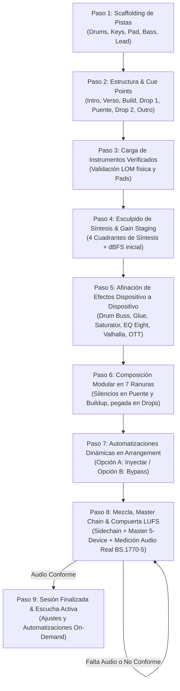

# Manual Maestro de `copilot_guided_session`
## Guía de Uso, Arquitectura del Motor y Código de Gobernanza Estricto

---

## 1. ¿Qué es `copilot_guided_session` y cuál es su Uso Principal?

### Propósito Fundamental
`copilot_guided_session` es el **asistente de dirección técnica y producción musical integral** de AbletonEngine. Diseñado bajo el paradigma de máquina de estados conversacional, actúa como un copiloto de producción que trabaja en pareja (*pair-programming / pair-producing*) con el productor para llevar una canción desde un proyecto en blanco de **Ableton Live 12** hasta un máster final terminado, calibrado y certificado bajo estándares acústicos internacionales de la industria.

### Problema que Resuelve
Anteriormente, operar Ableton mediante llamadas individuales a herramientas MCP resultaba en un flujo desordenado, propenso a olvidar configuraciones intermedias, cargar presets vacíos (*Init*), apilar efectos sin ajustar parámetros o avanzar a ciegas sin medir el audio real. `copilot_guided_session` centraliza todo el ciclo de vida en un **diálogo guiado paso a paso** donde el motor:
1. Configura la arquitectura de canales y reserva roles acústicos.
2. Escribe la estructura formal y marcadores de sección en la vista Arrangement.
3. Carga y verifica físicamente instrumentos VST3 y kits de batería (inspeccionando pads y cadenas).
4. Obliga a esculpir los 4 cuadrantes de síntesis y ajusta la ganancia inicial de pista (dBFS).
5. Afina efecto por efecto y parámetro por parámetro cada procesador de inserción.
6. Compone notas modulares en ranuras dedicadas (`0..6`) con silencios estructurales dinámicos.
7. Aplica el catálogo de automatizaciones de transición calculadas (risers, washouts, vacíos pre-drop).
8. Ejecuta la compuerta de masterización bloqueante basada **estrictamente en audio real bajo norma ITU-R BS.1770-5**.
9. Permanece en escucha activa continua para ajustes quirúrgicos post-producción en lenguaje natural.

---

## 2. Las Reglas Estrictas e Inviolables (El Código de Gobernanza)

Estas reglas han sido forjadas para erradicar cualquier complacencia del motor y garantizar que cada pista suene profesional:

---

### 🚨 REGLA 1: CERO ESTIMACIONES SINTÉTICAS (Auditoría de Audio Real Obligatoria)
* **Principio**: Queda terminantemente prohibido generar reportes de sonoridad utilizando fórmulas matemáticas sintéticas (como aproximaciones de ondas sinusoidales `np.sin`).
* **Protocolo**:
  1. El motor debe auditar **únicamente muestras de audio físico real**:
     * Archivo `.wav` renderizado fresco en el proyecto, o
     * Muestras PCM estéreo capturadas en vivo por socket UDP (puerto 9878) mientras Live reproduce.
  2. Si no se detecta audio físico, el valor de Integrated LUFS y True Peak **debe ser `None`**.
  3. No se toleran "estimaciones previas": si no hay audio, el estado es `BLOCKED_AWAITING_AUDIO`.

---

### ⛔ REGLA 2: COMPUERTA BLOQUEANTE INCONDICIONAL (El Gatekeeper no es negociable)
* **Principio**: La compuerta de la Fase 8 (Masterización y LUFS) es una barrera física estricta. **Nunca se avanza a la fase de finalización cantando victorias falsas**.
* **Protocolo de Bloqueo**:
  1. **Sin Audio Real**: Si no hay archivo WAV o stream UDP, el motor retorna `status: "BLOCKED_AWAITING_AUDIO"`, `retry_required: True`, y **mantiene la sesión congelada en la Fase 8**.
  2. **Incumplimiento de Tolerancias**: Si el audio medido no cumple con el estándar (`CLUB`: $-8.5 \text{ LUFS} \pm 1.0$, $\text{Max TP } -0.5 \text{ dBTP}$; `STREAMING`: $-14.0 \text{ LUFS} \pm 1.0$, $\text{Max TP } -1.0 \text{ dBTP}$):
     * Emite `status: "NON_COMPLIANT_LUFS"`.
     * Reporta la desviación exacta en dB y calcula la corrección de ganancia necesaria (`required_trim_db`).
     * **Bloquea el avance**. Exige corregir el fader/limitador en Live y re-auditar antes de otorgar la certificación.
  3. **Única Vía de Avance**: Solo cuando `audit_res.passed == True` y se emite el certificado oficial de cumplimiento, la sesión avanza a `PHASE_9_COMPLETED`.

---

### 🛡️ REGLA 3: CERO SILENCIAMIENTO DE ERRORES (Zero Silent Swallow)
* **Principio**: Queda prohibido envolver fallos de carga en bloques `try/except` complacientes que ignoren errores o timeouts y continúen fingiendo que la pista está lista.
* **Protocolo**:
  1. Si un plugin VST (Serum 2, Vital, Analog Lab V) o un Drum Rack falla al cargarse o excede el tiempo de respuesta:
     * El motor detiene inmediatamente el progreso.
     * Retorna `status: "LOAD_FAILED"`, `retry_required: True`.
     * Conserva el puntero en la misma pista hasta que se resuelva o el usuario elija conscientemente una alternativa.
  2. Prohibido avanzar dejando un instrumento nativo vacío por defecto (*Ac Pianos* o patch *Init*).

---

### 🥁 REGLA 4: VERIFICACIÓN FÍSICA DE DRUM RACKS Y VSTS
* **Principio**: No basta con que una pista tenga un dispositivo insertado; debe sonar de verdad.
* **Protocolo**:
  1. En pistas de batería (`DRUMS`), el motor debe consultar la API (`get_drum_rack_pads` / `get_drum_pad_devices`) y verificar que al menos los pads críticos (Kick C1/36, Snare D1/38, Clap D#1/39, Hats F#1/42) tengan samples asignados.
  2. En sintetizadores, se verifica que la cadena contenga parámetros manipulables ($\Delta \ge 1$).

---

### 🎛️ REGLA 5: ESCULPIDO OBLIGATORIO DE SÍNTESIS (Fase 4)
* **Principio**: Queda prohibido saltar de la carga de instrumentos a la composición sin afinar el sonido.
* **Protocolo**:
  1. Para cada sintetizador, se deben parametrizar explícitamente los 4 cuadrantes de síntesis:
     * **Osciladores / Wavetable**: Posición de tabla, unísono y sub-oscilador.
     * **Filtro**: Frecuencia de corte (*Cutoff*), resonancia y saturación de filtro (*Drive*).
     * **Envolventes ADSR**: Ataque percusivo vs suave, decay, sustain y release.
     * **Espacio / Modulación**: Brillo y macros.
  2. Cada canal se calibra a su nivel de ganancia óptimo en dBFS con `AutoGainStagingEngine` y se reporta el margen de headroom al Master.

---

### 🔌 REGLA 6: AFINACIÓN EFECTO POR EFECTO, PARÁMETRO POR PARÁMETRO (Fase 5)
* **Principio**: Queda prohibido cargar efectos en bloque o dejarlos con sus presets de fábrica.
* **Protocolo**:
  1. Se recorre cada uno de los procesadores de inserción de forma individual.
  2. Cada dispositivo expone y ajusta sus controles reales:
     * **Drum Buss**: Drive, Crunch, Transients, Boom, Output Gain.
     * **Glue Compressor**: Threshold, Ratio, Attack, Release, Makeup, Dry/Wet.
     * **Saturator / EQ Eight / Valhalla / OTT**: Frecuencias, cortes, tiempos y mezcla.
  3. Cada inserción actualiza el reporte de ganancia para evitar acumulación descontrolada de señal.

---

### 🎼 REGLA 7: COMPOSICIÓN MODULAR CON SILENCIOS ESTRUCTURALES (Fase 6)
* **Principio**: Queda prohibido generar un solo clip con toda la canción o pegar un bucle de 4 compases idéntico en toda la línea de tiempo.
* **Protocolo**:
  1. La composición se distribuye en **7 ranuras de clips dedicadas (`0..6`)** por pista:
     * `0`: Intro (8 compases).
     * `1`: Verso (16 compases).
     * `2`: Buildup (8 compases).
     * `3`: Drop 1 (16 compases).
     * `4`: Puente / Calma (8 compases).
     * `5`: Drop 2 (16 compases).
     * `6`: Outro (8 compases).
  2. **Silencios Estructurales Obligatorios**:
     * **Puente (c. 49-56)**: Silencio total en batería (0 notas) y silencio en bajo (0 notas). Solo textura armónica (Keys/Pads).
     * **Buildup (c. 25-32)**: Redoble progresivo de caja acelerado ($1/4 \to 1/8 \to 1/16 \to 1/32$) con **bajo completamente silenciado** para crear tensión previa al drop.
     * **Drops (c. 33-48 y 57-72)**: Pegada máxima con notas a velocidad 127 y 808 saturado.
  3. Despliegue independiente en la línea de tiempo del Arrangement de Live.

---

### 📈 REGLA 8: AUTOMATIZACIONES VECTORIALES TANGIBLES (Fase 7)
* **Principio**: Las transiciones no son teóricas; deben quedar dibujadas físicamente en los carriles de automatización del Arrangement View.
* **Protocolo**:
  1. El motor calcula las curvas mediante `ProductionRecipeEngine` y `ArrangementAutomationWeaver`.
  2. Al seleccionar la **Opción A (Botón A)**, se inyectan las envolventes vía `create_arrangement_automation_envelope`:
     * Risers de filtro en builds.
     * Washouts de reverb pre-drop con snap a cero en el downbeat.
     * Cortes de silencio de vacío (*Pre-Drop Vacuum*) de 2 beats antes del impacto.
     * Desvanecimientos graduales en el outro.
  3. La **Opción B (Botón B)** permite omitir (Bypass) conscientemente si el usuario así lo decide.

---

### 🧠 REGLA 10: CERO VALORES SUGERIDOS EN CONFIGURACIONES (Exposición Obligatoria de Rangos y Razonamiento Cognitivo)
* **Principio**: El motor **no debe proporcionar valores sugeridos pre-cocinados** ni recetas arbitrarias en ninguna etapa de configuración (pistas, estructura, síntesis, efectos, notas o master). La única excepción admitida es el listado de plugins e instrumentos disponibles (Fase 3), ya que provienen de la indexación del sistema.
* **Protocolo de Operación**:
  1. **Exposición de Límites Físicos y Rangos**: El motor debe poner sobre la mesa los rangos numéricos reales (ej: `0.0 - 1.0`, `20 Hz - 20,000 Hz`, `-40 dB a 0 dB`), las escalas métricas y la física acústica de cada control.
  2. **Invitación Obligatoria al Razonamiento**: Cada paso debe exigir explícitamente una **Decisión Técnica Requerida**, invitando a la IA/productor a pensar sobre la función acústica, el rango dinámico y el balance espectral antes de elegir.
  3. **Libertad Paramétrica Total**: La IA tiene potestad de definir cualquier cifra, porcentaje o combinación de parámetros dentro de los límites válidos.

---

### ⚡ REGLA 9: CERO INTERRUPCIONES INNECESARIAS (No Stop Hooks)
* **Principio**: No interrumpir al usuario con ventanas modales redundantes de confirmación cuando ya se ha ordenado una acción.
* **Protocolo**: Ejecutar las operaciones directamente, manteniendo la agilidad en la terminal y reportando los resultados finales con claridad.

---

## 3. Arquitectura del Pipeline de 8 Pasos



---

## 4. Guía Práctica de Uso Paso a Paso

### Iniciar o Reiniciar una Sesión
En cualquier entorno conectado a AbletonEngine (terminal, socket MCP o Python):

```python
from engine.production.copilot.guided_session import copilot_guided_session_engine

# Inicia una sesión limpia desde el Paso 1
resultado = copilot_guided_session_engine.step(conn=ableton_conn, user_input="", reset=True)
print(resultado["question"])
```

### Paso a Paso Conversacional

#### Paso 1: Configuración de Pistas
* **Pregunta**: Elige la arquitectura de canales.
* **Cómo responder**: 
  * `"Opción A"` (Recomendada: Drums, Keys, Pad, 808 Bass, Lead Synth).
  * `"Opción B"` (Trío Esencial: Drums, Bass, Keys).
  * O escribe tu lista de canales personalizada.

#### Paso 2: Estructura y Secciones
* **Pregunta**: Elige la estructura formal en compases.
* **Cómo responder**:
  * `"Opción A"` (Estándar 96 compases / ~3:00 min).
  * `"Opción B"` (Compacto 64 compases / ~2:00 min).
  * O especifica compases (ej: `'Intro 8, Verso 16, Buildup 8, Drop 16, Puente 8, Drop 16, Outro 8'`).

#### Paso 3: Instrumentos y Kits Verificados
* **Pregunta**: Elige el generador sonoro para cada pista (avanza canal por canal).
* **Cómo responder**:
  * `"Opción 1"`, `"Opción 2"`, etc. (Presets curados como *808 Core Kit*, *Analog Lab Rhodes*, *Serum Lead*, *Vital Sub*).
  * El motor verifica la instanciación física en Live antes de permitirte pasar a la siguiente pista.

#### Paso 4: Esculpido de Síntesis y Gain Staging
* **Pregunta**: Ajusta los 4 cuadrantes tímbricos para cada sintetizador.
* **Cómo responder**:
  * `"Opción 1"` (Cálido y Analógico), `"Opción 2"` (Brillante y Moderno), `"Opción 3"` (Pesado y Agresivo).
  * O define parámetros específicos (ej: `'Cutoff 75%, Drive 30%, Attack 10ms'`).
  * El motor aplica los cambios en Live y calibra el fader de volumen en dBFS.

#### Paso 5: Cadena de Efectos de Inserción
* **Pregunta**: Configura cada efecto individualmente (Drum Buss, Glue Compressor, etc.).
* **Cómo responder**:
  * `"Opción 1"` (Aplica parámetros recomendados de gain staging).
  * Parámetros personalizados (ej: `'Drive 0.35, Crunch 0.40, Transients 0.65'`).
  * `"Bypass"` (Omite el efecto actual y pasa al siguiente).

#### Paso 6: Composición Modular de Notas
* **Pregunta**: Define la tonalidad, escala y tempo.
* **Cómo responder**:
  * Ejemplo: `"Tonalidad F menor a 120 BPM"`.
  * El motor compone los clips en las ranuras 0 a 6 con silencios dinámicos y los copia al Arrangement.

#### Paso 7: Automatizaciones Dinámicas de Pistas
* **Pregunta**: ¿Deseas inyectar las curvas de transición calculadas?
* **Cómo responder**:
  * `"Opción A"` (o Botón A): Inyecta risers de filtro, washouts de reverb, cortes de vacío pre-drop y fade out de cierre.
  * `"Opción B"` (o Botón B): Omite las automatizaciones (Bypass) y pasa al master.

#### Paso 8: Mezcla, Master Chain y Compuerta Estricta de LUFS
* **Pregunta**: Selecciona el objetivo de masterización comercial.
* **Cómo responder**:
  * `"Club a -8.5 LUFS"` (Club / Trap, máxima pegada).
  * `"Streaming a -14 LUFS"` (Spotify / Apple Music broadcast).
* **Desbloqueo de la Compuerta**:
  * Para superar la compuerta, **debe haber audio real sonando o renderizado**.
  * En Live, dale a *Play* para emitir audio por el puerto 9878, o exporta un render `.wav` al proyecto.
  * Responde `"Reauditar"` o `"Medir"`.
  * Si los niveles cumplen la norma, el motor emite el certificado oficial y finaliza la sesión con éxito.

#### Paso 9: Escucha Activa y Ajustes Continuos
* **Uso**: El Copilot permanece en escucha activa en la misma herramienta.
* **Comandos disponibles en lenguaje natural**:
  * `"Sube 2 dB a los pads"`
  * `"Cambia el tempo a 126 BPM"`
  * `"Mutea el bajo en el verso"`
  * `"Automatiza el filtro del Lead en el verso 2"`
  * `"Aplica un corte de vacío de 1 compás antes del Drop 2"`

---

## 5. Mantenimiento y Verificación de Calidad

Para validar en cualquier momento que la implementación respeta el 100% de estas reglas y gobernanza:

```powershell
python -m pytest tests/test_guided_session.py tests/test_lufs_validation_gate.py tests/test_role_orchestrator.py -v
```

**Estándar de Calidad Exigido**: **26/26 pruebas unitarias exitosas (0 fallos tolerados)**.
