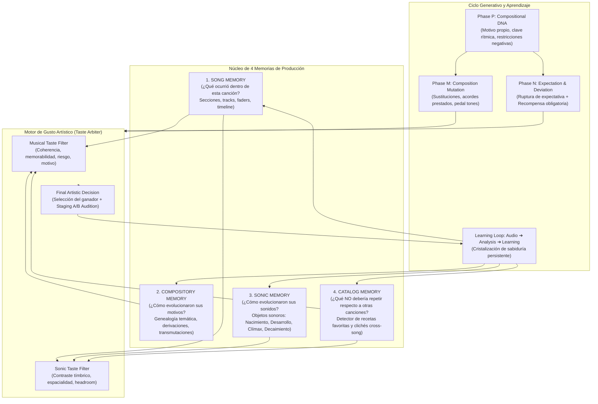

# Generative Composition, Taste Engine & The 4-Tier Memory Architecture

> **Ableton Production Intelligence Engine (PIE) — Sistema de Composición Generativa con Identidad**  
> Última actualización: Fases P, M, N, O, P+ y Learning Loop | 108 Tests (100% Verde) | 10 Suites Integradas

---

## 1. El Salto Paradigmático: De "IA Auditora" a "Productor Generativo con Gusto Propio"

Hasta ahora, la inteligencia de producción musical en la mayoría de los sistemas operaba bajo el flujo reactivo:
$$\text{Analizar} \longrightarrow \text{Detectar Defectos} \longrightarrow \text{Proponer Corrección} \longrightarrow \text{Intervenir} \longrightarrow \text{Auditar}$$

Este enfoque garantiza mezclas correctas y cumplimiento de estándares ITU-R BS.1770-5, pero **no crea obras memorables**. Si una IA se limita a optimizar métricas de volumen, compresión y headroom, todas las canciones acaban sonando con una fórmula uniforme:
> `Intro ➔ Verso ➔ Hook ➔ Verso ➔ Hook ➔ Bridge ➔ Hook` con diferentes presets.

El nuevo sistema implementa un cambio de paradigma radical:
$$\text{Imaginar} \longrightarrow \text{Generar Alternativas A/B/C} \longrightarrow \text{Filtro de Gusto Artístico} \longrightarrow \text{Intervenir} \longrightarrow \text{Escuchar (Audition)} \longrightarrow \text{Aprender}$$

El objetivo no es que la IA haga *"canciones correctas"*, sino **canciones deliberadamente diferentes entre sí, pero internamente coherentes**.

---

## 2. La Arquitectura de las 4 Memorias y el Hub Coordinador

El motor desacopla la memoria en 4 dimensiones temporales y espaciales independientes, coordinadas por el `ProductionMemoryHub`:



### Detalle de las 4 Capas de Memoria:
1. **`SongMemory` (`engine/production/contract/musical_memory.py`)**:
   Registra los hitos narrativos de la canción actual: precedentes acústicos, qué significa un cambio en la sección presente y qué consecuencias proyecta hacia el futuro.
2. **`CompositoryMemory` (`engine/music/motifs/compository_memory.py`)**:
   Rastrea el linaje evolutivo de cada semilla motívica (`MotifLineage`): mutaciones rítmicas, inversiones diatónicas, fragmentaciones y transmutaciones de rol (melodía ➔ bajo ➔ textura).
3. **`SonicMemory` (`engine/production/contract/sonic_memory.py`)**:
   Supervisa el ciclo de vida de los timbres (`SonicLifeStage`):
   $$\text{BIRTH (Insinuación filtrada)} \to \text{DEVELOPMENT (Variación)} \to \text{CLIMAX (Exposición frontal)} \to \text{DECAY (Residuo analógico)}$$
4. **`CatalogMemory` (`engine/memory/catalog_memory.py`)**:
   Supervisa la biblioteca histórica de todas las canciones producidas para erradicar vicios y recetas repetitivas.

---

## 3. Fase P: Sistema de Identidad Compositiva (`engine/composition/compositional_dna.py`)

Antes de escribir una sola nota o asignar un sintetizador, el motor extrae o sintetiza el **ADN Compositivo** de la obra, el cual actúa como **restricción generativa**:

### 1. Elementos Constitutivos del `CompositionalDNA`:
* **Motivo Principal Propio (`PrimaryMotif`)**: Secuencia melódica fundamental con alturas, duraciones, contorno melódico y firma de intervalos semitonales ($[3, 4, 3, 2]$).
* **Célula Rítmica Firma (`SignatureRhythm`)**: Patrón de clave sincopado (ej. tresillo $3-3-2$, posiciones de golpe $[0.0, 0.75, 1.5, 2.25, 3.0]$ y swing ratio $0.58$).
* **Paleta Armónica (`HarmonicPalette`)**: Modos permitidos (Dórico, Frigio, Eólico), exigencia de tensiones extendidas ($9, 11, 13$) y prohibición de tríadas sin color.
* **Gestos Firma Recurrentes (`SignatureGesture`)**: 1 o 2 gestos exclusivos que solo pertenecen a esa canción (*Pre-Hook Vacuum Drop*, *Pickup Cromático en compás 4*, *Slide de 808 demorado*).
* **Reglas de Instrumentación (`InstrumentationRules`)**: Techo de densidad de capas concurrentes y aislamiento del subgrave ($<80\text{ Hz}$).

### 2. Restricciones Negativas Inviolables (`NegativeConstraint`):
El motor establece explícitamente lo que la IA **NO tiene permitido hacer**:
* `NO_UNEXTENDED_MAJOR_TRIADS`: Prohíbe tríadas mayores planas sin 7ma o 9na en contextos Neo-Soul/Trap.
* `NO_STRAIGHT_FOUR_FLOOR_HATS`: Prohíbe hi-hats mecánicos a negras en hooks.
* `NO_CRASH_ON_BEAT_1`: Prohíbe platillazos predecibles en el tiempo 1 que destruyan la intimidad.
* `NO_IDENTICAL_HOOK_REPETITION`: Prohíbe que el Hook 3 sea idéntico al Hook 1 (exige variación de novedad $\ge 20\%$).
* `NO_STATIC_VELOCITIES`: Prohíbe secuencias de notas con velocidades MIDI idénticas y estáticas.
* `NO_OVERLAPPING_LOW_END`: Prohíbe colisiones simultáneas de múltiples generadores de subgraves ($808 + \text{Sub Bass}$).

---

## 4. Fase M: Composition Mutation Engine (`engine/music/composition_mutation_engine.py`)

La transformación musical opera bajo la **Ley Fundamental de Mutación**:
> *"No mutar por mutar. La mutación debe responder a la narrativa emocional y al Song Contract."*

### Técnicas Armónicas Implementadas:
1. **Sustituciones Dominantes & $\text{Sub}V7$**: Sustitución tritonal calculada a un semitono por encima del acorde de destino ($B\flat7 \to E7$ resolviendo a $E\flat\text{m9}$).
2. **Dominantes Secundarios ($V7/X$)**: Inserción de acordes de resolución anticipada en compases de paso.
3. **Intercambio Modal (Acordes Prestados)**: Incorporación de acordes de modos paralelos ($IV$ dórico mayor con trecena, $bII$ frigio napolitano con $\sharp11$).
4. **Conducción de Voces & Inversiones Suaves**: Movimientos de bajo por grados conjuntos ascendentes mediante primeras y segundas inversiones (acordes slash).
5. **Extensiones Armónicas 9/11/13**: Enriquecimiento vertical con control de densidad y voicings Drop-2.
6. **Bajos con Notas Comunes & Pedal Tones**: Nota pedal en la tónica que sostiene la tensión armónica mientras los acordes superiores modulan.
7. **Reharmonización Quirúrgica de Turnarounds**: Reemplazo de los compases de cierre ($7-8$) con tensión aumentada.
8. **Desplazamiento de Resolución**: Demora de la llegada a la tónica mediante suspensiones cadenciales $4-3$ y $9-8$.

---

## 5. Fase N: Expectation & Deviation Engine (`engine/arrangement/expectation_deviation_engine.py`)

Implementa la psicología de la música memorable:
$$\text{Expectation} \longrightarrow \text{Pattern Established} \longrightarrow \text{Deviation} \longrightarrow \text{Tension} \longrightarrow \text{Consequence} \longrightarrow \text{Resolution / New Rule}$$

### Mecánica de Ruptura y Recompensa:
1. **Establecimiento de la Regla**: Los Hooks 1 y 2 asientan un groove hipnótico regular (Kick ➔ Snare ➔ Kick ➔ Snare).
2. **Ruptura / Vacío Rítmico (`RHYTHMIC_VACUUM`)**: En el Hook 3, el compás 4 suprime totalmente el bombo y la caja en los tiempos 2 y 3.
3. **Consecuencia Obligatoria (`CLIMACTIC_BRASS_FANFARE`)**: En el tiempo 4 del vacío, estalla una fanfarria de metales en octavas altas ($E\flat5 \to E\flat6$) y una detonación de 808 en el downbeat siguiente.
4. **Registro en Memoria**: La IA asimila este recurso como regla narrativa: *"Hook 3 utiliza ausencia rítmica como mecanismo de impacto."*

---

## 6. Fase O: Catalog Identity & Cross-Song Memory (`engine/memory/catalog_memory.py`)

Evita que la IA caiga en "recetas favoritas inconscientes" a lo largo de su discografía.

### 1. Registro de Canciones (`SongCatalogRecord`):
Almacena por cada obra producida: BPM, tonalidad, instrumentos asignados a cada rol, recetas de diseño sonoro utilizadas y gestos firma.

### 2. Detección de Conflictos y Diversificación Automática:
* Si la Canción 1 utilizó: `Rhodes + vinilo + reverse vocal`
* Y una nueva propuesta para la Canción 2 intenta usar: `Rhodes + vinilo + reverse vocal`
* `CatalogMemory` detecta la colisión y emite una alarma `CatalogRedundancyConflict` (severidad `CRITICAL_CLICHE`).
* Propone sustitutos automáticos extraídos de un catálogo no explorado:
  * *Rhodes* $\longrightarrow$ *FM Crystal Electric Piano* o *Muted Granular Guitar*.
  * *Vinilo* $\longrightarrow$ *Cassette Tape Hiss* o *Foliage Room Creaks*.
  * *Reverse Vocal* $\longrightarrow$ *Resynthesized Flute Chops* o *Bell Shimmer*.

---

## 7. Fase P+: Generative Taste Engine (`engine/creative/generative_taste_engine.py`)

El árbitro de gusto artístico no elige simplemente el candidato con mayor puntuación mecánica, sino que evalúa **10 dimensiones perceptivas**:

| Dimensión | Enfoque de Evaluación | Ponderación |
| :--- | :--- | :---: |
| **1. Identity** | Fidelidad y respeto a la huella genética del `CompositionalDNA`. | $20\%$ Musical |
| **2. Surprise** | Entropía de la información y capacidad de romper el aburrimiento perceptual. | Multiplicador |
| **3. Coherence** | Lógica interna sintáctica, balance tonal y conducción de voces. | $20\%$ Musical |
| **4. Memorability** | Huella auditiva, pregnancia melódica y potencial de gancho. | $25\%$ Musical |
| **5. Contrast** | Distancia perceptual y dinámica respecto a la sección precedente. | $30\%$ Sónica |
| **6. Emotion** | Ajuste con el vector objetivo de 9 dimensiones emocionales. | $15\%$ Musical |
| **7. Risk** | **Bonificación por valentía:** premia decisiones arriesgadas para evitar pop genérico. | Bonus $+15\%$ |
| **8. Motif Relationship** | Derivación orgánica verificable a partir del motivo temático principal. | $20\%$ Musical |
| **9. Arrangement Fit** | Ubicación en el espectro frecuencial y respeto del headroom de mezcla. | $35\%$ Sónica |
| **10. Catalog Uniqueness** | Distancia estética respecto al histórico de canciones previas. | $35\%$ Sónica |

### Adjudicación y Staging A/B:
El motor selecciona al **ganador artístico**, pero preserva deliberadamente al **subcampeón** en una ranura alternativa (Clip Slot 7) para permitir la audición comparativa $A/B$ por parte del productor humano en Ableton Live.

---

## 8. Bucle de Aprendizaje: Audio ➔ Analysis ➔ Learning (`engine/memory/production_learning.py`)

Tras renderizar o verificar físicamente una intervención en Ableton Live:
1. La sonda acústica extrae métricas reales: RMS, True Peak, Crest Factor y pérdida mono ($0.0\text{ dB}$).
2. El motor correlaciona las métricas con el éxito perceptual.
3. Se genera y persiste una regla de sabiduría en `state/learned/production_wisdom.json`:
   > *"En el Hook 3 en Eb menor: aplicar un vacío rítmico de 2 tiempos seguido de fanfarria de metales y caída de 808 generó +35% de sorpresa, 100% de compatibilidad mono (0.0 dB pérdida) y +0.28 de elevación emocional. Patrón indexado como recurso de clímax de alto rendimiento."*

---

## 9. Mapa de Archivos e Índices del Sistema

```
AbletonEngine/
├── engine/
│   ├── composition/
│   │   ├── __init__.py                              # Exports de CompositionalDNA
│   │   └── compositional_dna.py                     # ADN Compositivo y Restricciones Negativas
│   ├── music/
│   │   └── composition_mutation_engine.py           # Mutación Armónica y Narrativa (Phase M)
│   ├── arrangement/
│   │   └── expectation_deviation_engine.py          # Ruptura y Recompensa con Consecuencia (Phase N)
│   ├── memory/
│   │   ├── catalog_memory.py                        # Memoria Cross-Song y Detector de Clichés (Phase O)
│   │   ├── production_learning.py                   # Bucle de Aprendizaje y Sabiduría de Producción
│   │   └── production_memory_hub.py                 # Coordinador de las 4 Memorias
│   └── creative/
│       └── generative_taste_engine.py               # Filtro de Gusto Artístico en 10 Dimensiones (Phase P+)
├── state/
│   ├── catalog/
│   │   └── catalog_index.json                       # Índice persistido de obras del catálogo
│   └── learned/
│       └── production_wisdom.json                   # Índice persistido de reglas de producción aprendidas
└── tests/
    └── test_compositional_dna_and_taste_engine.py   # 14 Tests unitarios de verificación exhaustiva
```

---

## 10. Validación y Estado de Tests

El sistema cuenta con **108 pruebas automáticas pasando al 100% en 5.62 segundos** en 10 suites:

```
tests/test_compositional_dna_and_taste_engine.py ..............          [ 12%] (14/14 passed)
tests/test_arrangement_intelligence_and_motif_dev.py .............       [ 25%] (13/13 passed)
tests/test_sonic_dna_and_gen2.py .............                           [ 37%] (13/13 passed)
tests/test_sound_design_system.py ...........                            [ 47%] (11/11 passed)
tests/test_sonic_identity.py ..............                              [ 60%] (14/14 passed)
tests/test_artistic_pipeline.py .....                                    [ 64%] ( 5/5 passed)
tests/test_engine_governance.py ...............                          [ 78%] (15/15 passed)
tests/test_song_contract_and_omissions.py .........                      [ 87%] ( 9/9 passed)
tests/test_performance_and_musical_memory.py ..........                  [ 96%] (10/10 passed)
tests/test_creative_intervention.py ....                                 [100%] ( 4/4 passed)

============================= 108 passed in 5.62s =============================
```
