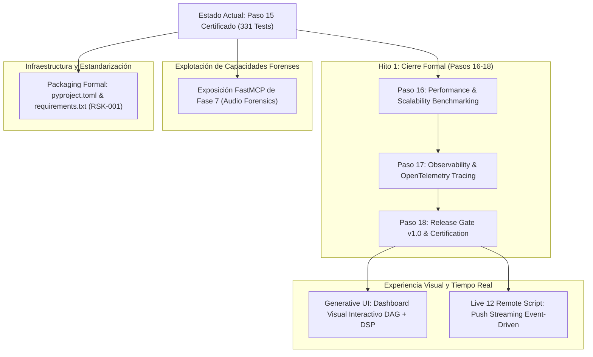

# Ableton Production Intelligence Engine (PIE) — Hoja de Ruta y Pasos Siguientes

> **Documento Estratégico y Técnico de Continuidad del Proyecto**  
> **Fecha:** 2026-09-04 | **Versión:** 1.0  
> **Estado Actual:** Hito 1 (Pasos 01 al 15 completados) + Fase 7 (Audio Forensics implementada) | 331 Tests (100% Verde)

---

## 1. Resumen Ejecutivo del Estado del Sistema

El sistema cuenta con:
- **Capa de Gobernanza de Producción (Hito 1, Pasos 01-15):** Completa y certificada.
  - Grafo causal acíclico inmutable ([`ProductionGraph`](file:///d:/Proyectos/TEST/AbletonEngine/engine/production/graph.py)).
  - Memoria contextual de decisiones con invariante Candidate-Only ([`DecisionMemory`](file:///d:/Proyectos/TEST/AbletonEngine/engine/production/memory.py)).
  - Motor de políticas con guardrails inviolables ([`ProductionPolicyEngine`](file:///d:/Proyectos/TEST/AbletonEngine/engine/production/policies.py)).
  - Planificador bajo el Principio de Mínima Intervención ([`ProductionPlanner`](file:///d:/Proyectos/TEST/AbletonEngine/engine/production/planner.py)).
  - Ejecutor atómico con verificación multi-criterio y auto-rollback ([`ProductionExecutor`](file:///d:/Proyectos/TEST/AbletonEngine/engine/production/executor.py)).
  - Rollback de primera clase no destructivo ([`RollbackEngine`](file:///d:/Proyectos/TEST/AbletonEngine/engine/production/rollback.py)).
  - Superficie FastMCP de 9 herramientas de gobernanza ([`server.py`](file:///d:/Proyectos/TEST/AbletonEngine/server.py)).
  - Pipeline Golden E2E verificado sin mocks internos ([`tests/test_production_integration.py`](file:///d:/Proyectos/TEST/AbletonEngine/tests/test_production_integration.py)).
  - Batería de caos y tolerancia a fallos ([`tests/test_failure_injection.py`](file:///d:/Proyectos/TEST/AbletonEngine/tests/test_failure_injection.py)).
- **Motor Forense Acústico (Fase 7):** Completado en núcleo DSP ([`engine/forensics/`](file:///d:/Proyectos/TEST/AbletonEngine/engine/forensics/)) con 31 pruebas unitarias.
- **Suite Maestra de Pruebas:** 331 pruebas en verde (0 fallos, 0 errores, 0 omitidos).

---

## 2. Hoja de Ruta Inmediata (Próximas Fases de Desarrollo)

---

## 3. Especificación Detallada de los Pasos Siguientes

### 3.1 Paso 16 — Performance & Scale Benchmarking (Hito 1, Paso 16 de 18)
* **Objetivo:** Demostrar que la gobernanza causal, el fingerprinting SHA-256 y la persistencia atómica escalan de forma predecible sin degradar la experiencia en sesiones de alta densidad.
* **Escenarios de Prueba a Implementar (`tests/test_production_benchmarks.py`):**
  - **Sesión Masiva:** Benchmark de sesión con 32, 64 y 128 pistas, midiendo latencia de `context.compute_session_fingerprint()`. Objetivo: $\le 15\text{ ms}$.
  - **Traversal del DAG:** Medición de tiempo de ejecución de `graph.explain_decision()` y detección de ciclos en grafos con más de 1,000 nodos. Objetivo: $\le 5\text{ ms}$.
  - **Throughput Transaccional:** Ejecución de 100 transacciones secuenciales con fsync forzado en disco. Objetivo: $\ge 50\text{ tx/s}$.
  - **Consumo de Memoria:** Comprobación de que `SessionShadowGraph` y `ProductionGraph` no presentan fugas de memoria tras 1,000 ciclos de planificación/rollback.

### 3.2 Paso 17 — Observability & OpenTelemetry Distributed Tracing (Hito 1, Paso 17 de 18)
* **Objetivo:** Instrumentar de forma nativa cada invocación MCP, transacción y verificación acústica para trazabilidad distribuida.
* **Entregables:**
  - Exportador OpenTelemetry configurable (OTLP / Jaeger / Console) en `telemetry.py`.
  - Spans estructurados para: `mcp_tool_execution`, `policy_evaluation`, `transaction_atomic_boundary`, `dsp_measurement`, `verification_matrix_evaluation`.
  - Métricas de telemetría: contador de rollbacks automáticos, histograma de latencia de limitación, ratio de violación de guardrails.

### 3.3 Paso 18 — Final Release Gate & Certificación v1.0 (Hito 1, Paso 18 de 18)
* **Objetivo:** Cierre formal del Hito 1 de Gobernanza, Causalidad y Loudness.
* **Entregables:**
  - Manifiesto criptográfico inmutable de release (`release_manifest_v1.0.json`).
  - Informe formal de certificación de Hito 1 (`docs/audit/HITO_1_CERTIFICATION_REPORT.md`).
  - Verificación estricta de no-regresión sobre las Fases 1 a 6.

---

### 3.4 Integración FastMCP de Fase 7 (Audio Forensics)
* **Objetivo:** Permitir que el LLM acceda a las capacidades de diagnóstico quirúrgico desarrolladas en `engine/forensics/`.
* **Herramientas a incorporar en `server.py`:**
  1. `forensics_analyze_track(track_id, window_size, hop_size)`: Retorna diagnóstico temporal y espectral localizado.
  2. `forensics_detect_anomalies(track_id)`: Detección y localización temporal de DC offset, clicks, pops y dropouts.
  3. `forensics_spectral_profile(track_id)`: Retorna percentiles energéticos $p_{10}$, $p_{50}$ y $p_{90}$ en 14 bandas de frecuencia.
  4. `forensics_masking_map(track_a, track_b)`: Mapeo de colisiones espectrales entre dos stems.
  5. `forensics_correlation_matrix()`: Matriz de correlación de fase y retardo inter-canal.
  6. `forensics_export_report(track_id)`: Genera reporte firmado criptográficamente SHA-256.

---

### 3.5 Infraestructura y Empaquetado Formal (Resolución de RSK-001)
* **Objetivo:** Estandarizar la instalación del motor como paquete Python moderno y reproducible.
* **Entregables:**
  - [`pyproject.toml`](file:///d:/Proyectos/TEST/AbletonEngine/pyproject.toml): Configuración de build backend (`setuptools` / `hatchling`), metadatos del proyecto, versión (`1.0.0`), dependencias obligatorias y grupos opcionales (`[project.optional-dependencies] dev = [...]`).
  - [`requirements.txt`](file:///d:/Proyectos/TEST/AbletonEngine/requirements.txt): Bloqueo de dependencias de producción.
  - [`requirements-dev.txt`](file:///d:/Proyectos/TEST/AbletonEngine/requirements-dev.txt): Dependencias de test, linters y benchmarking (`pytest`, `pytest-benchmark`, `coverage`).

---

### 3.6 Generative UI: Dashboard Visual de Gobernanza y Acústica
* **Objetivo:** Proporcionar al productor una visualización gráfica e interactiva de lo que PIE está decidiendo.
* **Componentes de la UI:**
  - **DAG Causal Interactivo:** Visualizador en SVG/HTML con nodos coloreados según su tipo (`INTENT` en azul, `POLICY_CHECK` en morado, `ACTION` en naranja, `RESULT` en verde, `ROLLBACK` en rojo).
  - **Radar de Loudness & Picos:** Comparativa gráfica de LUFS integrado vs short-term y medidor de True Peak vs techo normativo.
  - **Matriz de Regresión:** Visualización tipo heatmap de las métricas multivariables evaluadas.

---

### 3.7 Streaming Bidireccional en Tiempo Real (Live 12 Remote Script)
* **Objetivo:** Eliminar la necesidad de sondeo (*polling*) para sincronizar cambios físicos hechos en Live.
* **Mecanismo:**
  - Canal de streaming de eventos (WebSocket o socket TCP secundario) en el script `AbletonMCP`.
  - Listeners de Ableton Python API para: fader moves, mute/solo, track add/delete, clip fire.
  - Actualización inmediata en milisegundos del `SessionShadowGraph`.

---

## 4. Matriz de Prioridades y Cronograma Sugerido

| Prioridad | Tarea | Esfuerzo Estimado | Impacto | Justificación |
| :---: | :--- | :---: | :---: | :--- |
| **P1** | **Packaging Formal (`pyproject.toml` & `requirements.txt`)** | Inmediato | Alto | Resuelve el riesgo RSK-001 y permite instalación estándar `pip install -e .`. |
| **P2** | **Exposición FastMCP de Fase 7 (Forensics)** | Corto | Muy Alto | Desbloquea para el LLM 31 tests de DSP forense ya desarrollados. |
| **P3** | **Paso 16 — Performance & Scale Benchmarks** | Medio | Alto | Formaliza el paso 16 de 18 de la secuencia del Hito 1. |
| **P4** | **Paso 17 — Observability & OpenTelemetry** | Medio | Medio | Habilita trazabilidad distribuida industrial en producción. |
| **P5** | **Paso 18 — Certificación Final v1.0** | Corto | Crítico | Congela formalmente el Hito 1 bajo contrato inmutable. |
| **P6** | **Dashboard Visual Interactivo (Generative UI)** | Medio | Muy Alto | Mejora radicalmente la experiencia del usuario y productor musical. |
| **P7** | **Push Streaming en Tiempo Real con Live** | Alto | Alto | Sincronización reactiva sin latencia de sondeo. |
