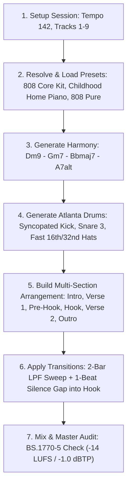

# Production Intelligence Engine (PIE) — Prompting Playbook & Recipes

> **Author**: Ableton Production Intelligence Engine Team  
> **Version**: 3.0 (Ableton Live 12 Suite Native)  
> **Repository**: [https://github.com/k3v-5/AbletonEngine.git](https://github.com/k3v-5/AbletonEngine.git)

---

## 1. Overview & Core Principles

The Ableton Production Intelligence Engine (PIE) connects large language models directly to Ableton Live 12 Suite via FastMCP, Python DSP engines, and live remote scripts.

To obtain **record-ready, human-sounding results**, follow these 4 core tenets:
1. **Never load blank init patches**: Reference curated native presets (`.adv` / `.adg`) or specify timbral descriptors (`felt piano`, `808 sub pure`, `orchestral strings`).
2. **Always pair drum composition with drum rack population**: Calling `music_generate_drums` populates MIDI notes; pair it with `preset_list_available` or `load_instrument_or_effect` (`query:Drums#FileId_5422` for `808 Core Kit`) so pads trigger actual samples.
3. **Use Arrangement Transitions & Automation**: Songs feel alive when energy sweeps before section drops. Use `arrangement_apply_transition` (filter sweeps, reverb washouts, volume pre-drop silence).
4. **Audit mix and master acoustics**: Before finishing a track, call `audio_listen_live` to check ITU-R BS.1770-5 LUFS, True Peak, phase correlation, and 250–500 Hz mud accumulation.

---

## 2. Playbook 1: Atlanta Bounce / JID x Tyler, The Creator Neo-Soul Beat

### User Prompt Example
> *"Genera un beat de 64 compases estilo bodies de JID con progresiones neo-soul estilo Tyler The Creator ('Look like my mama' / Dm9) a 142 BPM, con batería 808 completa y transiciones dinámicas."*

### Agent Workflow Recipe

#### Step-by-Step Tool Calls:
1. **Set Tempo & Track Architecture**:
   - `set_tempo(142.0)`
   - Create 9 tracks: `Main Drums`, `Hats & Perc`, `Sub 808`, `Chords Keys`, `Pad Atmosphere`, `Lead Hook`, `Bass Accent`, `Vocal FX`, `Reference`.
2. **Load Verified Presets**:
   - Track 1 (`Main Drums`): `instrument_load_preset(track="0", preset_name_or_role="808 Core Kit")`
   - Track 2 (`Hats & Perc`): `instrument_load_preset(track="1", preset_name_or_role="808 Core Kit")`
   - Track 3 (`Sub 808`): `instrument_load_preset(track="2", preset_name_or_role="808 Pure", genre="trap")`
   - Track 4 (`Chords Keys`): `instrument_load_preset(track="3", preset_name_or_role="Childhood Home Piano", genre="neo_soul")`
   - Track 5 (`Pad Atmosphere`): `instrument_load_preset(track="4", preset_name_or_role="VHS Dreams", genre="lofi")`
3. **Generate Musical Patterns**:
   - Chords: `music_generate_harmony(key="D", scale="dorian", bars=8, complexity=0.8)`
   - Drums: `music_generate_drums(genre="trap", bars=8, swing=0.15)`
   - Bass: `music_generate_bass(key="D", scale="dorian", bars=8, follow_kick=True)`
4. **Compile to Arrangement View**:
   - `duplicate_to_arrangement(track_index=0, clip_index=0, destination_time_beats=0.0)`
   - Set section cue points: `create_cue_point(name="Intro", time_beats=0.0)`, `create_cue_point(name="Drop/Hook", time_beats=64.0)`.
5. **Add Energy Transitions**:
   - `arrangement_apply_transition(track_index_or_id="3", transition_type="filter_sweep_up", start_bar=14.0, duration_bars=2.0, min_val=250.0, max_val=18000.0)`
   - `arrangement_apply_transition(track_index_or_id="0", transition_type="volume_swell", start_bar=14.0, duration_bars=2.0, pre_drop_silence_beats=1.0)`
6. **Live Ear Inspection**:
   - `audio_listen_live(duration_seconds=3.0)`

---

## 3. Playbook 2: Melodic Techno / Deep Club Journey

### User Prompt Example
> *"Crea un track de Melodic Techno a 126 BPM en Fa menor con un build hipnótico de 16 compases y un drop masivo, automatizando el filtro de Serum/Drift y aplicando sidechain pumping."*

### Step-by-Step Tool Calls:
1. **Instrument Selection**:
   - Track 0 (`Drums`): `instrument_load_preset(track="0", preset_name_or_role="AG Techno Kit")`
   - Track 1 (`Sub Bass`): `instrument_load_preset(track="1", preset_name_or_role="Basic Sub Sine")`
   - Track 2 (`Rolling Bass`): `instrument_load_preset(track="2", preset_name_or_role="Analog Bass")`
   - Track 3 (`Melodic Lead`): `instrument_load_preset(track="3", preset_name_or_role="Acceleration Lead")`
2. **Transition & Energy Automation**:
   - Build sweep: `arrangement_apply_transition(track_index_or_id="3", transition_type="filter_sweep_up", start_bar=16.0, duration_bars=4.0, min_val=300.0, max_val=19000.0)`
   - Reverb washout: `arrangement_apply_transition(track_index_or_id="3", transition_type="reverb_washout", start_bar=18.0, duration_bars=2.0, min_val=0.1, max_val=0.9)`
   - Bass sidechain ducking on drop: `arrangement_apply_transition(track_index_or_id="1", transition_type="sidechain_pump", start_bar=20.0, duration_bars=16.0, max_val=0.85)`
3. **Master Loudness & Headroom**:
   - Target: Club Sound System (-9.0 LUFS, -0.3 dBTP).
   - Audit: `audio_listen_live(duration_seconds=4.0)`

---

## 4. Playbook 3: Intelligent Mixdown & Mud Removal

### User Prompt Example
> *"Limpia la mezcla de esta sesión: busca frecuencias que choquen entre el bajo y el teclado, elimina el barro en 300 Hz y verifica que no haya problemas de fase en mono."*

### Step-by-Step Tool Calls:
1. **Acoustic Audit**:
   - `audio_listen_live(duration_seconds=3.0)`
   - Check `spectral_balance["low_mid_mud_percent"]` and `phase["stereo_correlation"]`.
2. **Surgical EQ & Conflict Resolution**:
   - If low-mid energy > 25%: Apply dynamic EQ dip on the keys/pads bus around 320 Hz.
   - If correlation < 0.3: Call `set_device_parameter` on the stereo widener or utility device to narrow width below 120 Hz.
3. **Headroom Management**:
   - Verify `loudness["headroom_to_0dbfs"] >= 3.0 dB` during mixdown before final limiter stage.

---

## 5. Playbook 4: Streaming & Master Delivery

### User Prompt Example
> *"Masteriza la pista actual para Spotify y Apple Music a -14 LUFS con True Peak menor a -1.0 dBTP."*

### Step-by-Step Tool Calls:
1. **Audit Readiness**:
   - `master_readiness()`
2. **Apply Master Chain**:
   - `master_create_chain(target="STREAMING", ceiling_dbtp=-1.0, target_lufs=-14.0)`
3. **Verify Translation & True Peak**:
   - `audio_listen_live(duration_seconds=3.0)`
   - Confirm `readiness["spotify_apple_streaming"]["status"] == "OPTIMAL"`.
   - Confirm `loudness["true_peak_dbtp"] <= -1.0`.
